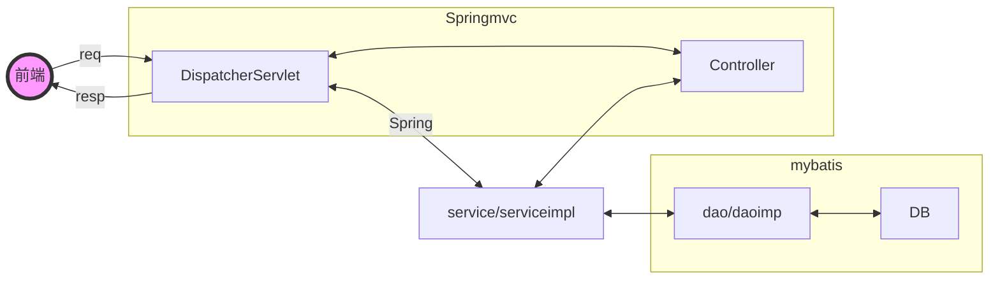

# ssm框架的整合：




> 进行SSM框架整合时，3个框架的分工如下所示。
> MyBatis负责与数据库进行交互。
> Spring负责事务管理, $pring可以管理持久层的Mapper对象及业务层的Service对象。由于Mapper对象和Service对象都在Spring容器中，所以可以在业务逻辑层通过Service对象调用持久层的Mapper对象。
> Spring MVC负责管理表现层的Handler。Spring MVC容器是Spring容器的子容器,因此Spring MVC容器可以调用Spring容器中的Service对象。

- ### 创建对应的数据库

- ### 创建项目  （创maven扩展web）

>- 导包  pom.xml
>
>```xml
><?xml version="1.0" encoding="UTF-8"?>
><project xmlns="http://maven.apache.org/POM/4.0.0"
>         xmlns:xsi="http://www.w3.org/2001/XMLSchema-instance"
>         xsi:schemaLocation="http://maven.apache.org/POM/4.0.0 http://maven.apache.org/xsd/maven-4.0.0.xsd">
>    <modelVersion>4.0.0</modelVersion>
>
>    <groupId>org.example</groupId>
>    <artifactId>SsmStudyNormal</artifactId>
>    <version>1.0-SNAPSHOT</version>
>
>    <properties>
>        <maven.compiler.source>8</maven.compiler.source>
>        <maven.compiler.target>8</maven.compiler.target>
>        <project.build.sourceEncoding>UTF-8</project.build.sourceEncoding>
>    </properties>
>    <packaging>war</packaging>
>
><dependencies>
>    <!-- Spring相关依赖  -->
>    <dependency>
>        <groupId>org.springframework</groupId>
>        <artifactId>spring-context</artifactId>
>        <version>5.2.8.RELEASE</version>
>    </dependency>
>    <!--Spring事务管理-->
>    <dependency>
>        <groupId>org.springframework</groupId>
>        <artifactId>spring-tx</artifactId>
>        <version>5.2.8.RELEASE</version>
>    </dependency>
>    <dependency>
>        <groupId>org.springframework</groupId>
>        <artifactId>spring-jdbc</artifactId>
>        <version>5.2.8.RELEASE</version>
>    </dependency>
>    <dependency>
>        <groupId>org.springframework</groupId>
>        <artifactId>spring-test</artifactId>
>        <version>5.2.8.RELEASE</version>
>    </dependency>
>    <!--Spring MVC的相关依赖  -->
>    <dependency>
>        <groupId>org.springframework</groupId>
>        <artifactId>spring-webmvc</artifactId>
>        <version>5.2.8.RELEASE</version>
>    </dependency>
>    <!--MyBatis相关依赖-->
>    <dependency>
>        <groupId>org.mybatis</groupId>
>        <artifactId>mybatis</artifactId>
>        <version>3.5.2</version>
>    </dependency>
>    <!--MyBatis与Spring整合相关依赖-->
>    <dependency>
>        <groupId>org.mybatis</groupId>
>        <artifactId>mybatis-spring</artifactId>
>        <version>2.0.1</version>
>    </dependency>
>    <!--数据源-->
>    <dependency>
>        <groupId>com.alibaba</groupId>
>        <artifactId>druid</artifactId>
>        <version>1.1.20</version>
>    </dependency>
>    <!--单元测试相关的依赖-->
>    <dependency>
>        <groupId>junit</groupId>
>        <artifactId>junit</artifactId>
>        <version>4.12</version>
>        <scope>test</scope>
>    </dependency>
>    <!-- 相关的依赖-->
>    <!--ServletAPI：引入servlet的功能   -->
>    <dependency>
>        <groupId>javax.servlet</groupId>
>        <artifactId>javax.servlet-api</artifactId>
>        <version>3.1.0</version>
>        <scope>provided</scope>
>    </dependency>
>    <!--ServletAPI: jsp页面的功能包   -->
>    <dependency>
>        <groupId>javax.servlet.jsp</groupId>
>        <artifactId>jsp-api</artifactId>
>        <version>2.2</version>
>        <scope>provided</scope>
>    </dependency>
>    <!-- 数据库驱动相关依赖-->
>    <dependency>
>        <groupId>mysql</groupId>
>        <artifactId>mysql-connector-java</artifactId>
>        <version>8.0.16</version>
>    </dependency>
>
>    <!--json格式返回值需要的包   俩-->
>    <dependency>
>        <groupId>com.fasterxml.jackson.core</groupId>
>        <artifactId>jackson-databind</artifactId>
>        <version>2.12.2</version>
>    </dependency>
>    <dependency>
>        <groupId>com.fasterxml.jackson.core</groupId>
>        <artifactId>jackson-annotations</artifactId>
>        <version>2.12.2</version>
>    </dependency>
></dependencies>
></project>
>```
>
>- applicationcontext.xml(spring)
>
>```xml
><beans xmlns="http://www.springframework.org/schema/beans"
>       xmlns:context="http://www.springframework.org/schema/context"
>       xmlns:tx="http://www.springframework.org/schema/tx"
>       xmlns:xsi="http://www.w3.org/2001/XMLSchema-instance"
>       xsi:schemaLocation="
>	http://www.springframework.org/schema/beans http://www.springframework.org/schema/beans/spring-beans-4.0.xsd
>	http://www.springframework.org/schema/context http://www.springframework.org/schema/context/spring-context-4.0.xsd
>	http://www.springframework.org/schema/tx http://www.springframework.org/schema/tx/spring-tx-4.0.xsd">
><!--    扫描被@Service标注的对象-->
><context:component-scan base-package="Service"/>
><!--   ======================================有关数据源及数据库的操作====================================================================================-->
><!--spring方式访问数据库-->
>    <context:property-placeholder location="classpath:db.properties"/>
><!--    dao层需要用的mybatis工具，在此统一配置-->
>    <bean id="myDS" class="com.alibaba.druid.pool.DruidDataSource">
>        <property name="driverClassName" value="${java_ssm_study.driver}"/>
>        <property name="url" value="${java_ssm_study.url}"/>
>        <property name="username" value="${java_ssm_study.username}"/>
>        <property name="password" value="${java_ssm_study.password}"/>
>    </bean>
><!--    事务的保障配置-->
><bean id="myTM" class="org.springframework.jdbc.datasource.DataSourceTransactionManager">
><!--    保障谁-->
>    <property name="dataSource" ref="myDS"/>
> </bean>
><!--    事务启动-->
>    <tx:annotation-driven transaction-manager="myTM"/>
>
>    <!--   ======================================有关数据源及数据库配置的操作====================================================================================-->
>
>    <!--   ======================================数据库操作===（创sqlsessionfactory）=================================================================================-->
><bean  id="sqlSessionFactory" class="org.mybatis.spring.SqlSessionFactoryBean">
>    <property name="dataSource" ref="myDS"/>
>    <property name="configLocation" value="classpath:mybatis-config.xml"/>
></bean>
>    <!--   ======================================数据库操作===（创sqlsessionfactory）========================================================================-->
>
>    <!--   ======================================bean的装配================================================================================-->
><!--    传统dao开发需要继承父类:SqlSessionDaoSupport,实现代码dao连接mapper.xml-->
><!--    <bean id="bookDaoImpl" class="Dao.BookDaoImpl">-->
><!--        <property name="sqlSessionFactory" ref="sqlSessionFactory"></property>-->
><!--    </bean>-->
>
>
><!--接口式编程bean装配  提供扫描工具，扫描对应的mapper完成java-mapper=》xml-mapper的映射-->
>    <bean class="org.mybatis.spring.mapper.MapperScannerConfigurer">
><!--         value的值  到哪个类上层的包即可-->
>        <property name="basePackage" value="mapper"></property>
>     </bean>
>  </beans>
>```
>
>- mybatis-config.xml
>
>```xml
><?xml version="1.0" encoding="UTF-8" ?>
><!DOCTYPE configuration
>        PUBLIC "-//mybatis.org//DTD Config 3.0//EN"
>        "http://mybatis.org/dtd/mybatis-3-config.dtd">
><configuration>
>
>    <settings>
>        <!--        打开二级缓存全局配置-->
>        <setting name="cacheEnabled" value="true" />
>        <!--        打开延迟加载开关-->
>        <setting name="lazyLoadingEnabled" value="true"/>
>        <!--        将积极加载改为消息加载，即按需加载-->
>        <setting name="aggressiveLazyLoading" value="false"/>
>
>
>    </settings>
><!--    typeAliases：别名处理器，可以为java类型（resultType）起别名。类型别名是为 Java 类型设置一个短的名字。它只和 XML 配置有关，存在的意义仅在于用来减少类完全限定名的冗余。-->
><!--    注意：在不指定别名情况下，别名默认就是类名小写。某些情况下别名不区分大小写。-->
><typeAliases>
><package name="domain"/>
></typeAliases>
>
></configuration>
>```
>
>- db.properties
>
>```
>java_ssm_study.driver=com.mysql.cj.jdbc.Driver
>java_ssm_study.url=jdbc:mysql://localhost:3306/java_ssm_study?useUnicode=true&characterEncoding=UTF-8&zeroDateTimeBehavior=convertToNull&useSSL=true
>java_ssm_study.username=root
>java_ssm_study.password=root
>
>```
>
>- mapper.xml
>- 接口式开发  时目录结构必须相同
>
>```xml
><?xml version="1.0" encoding="UTF-8" ?>
><!DOCTYPE mapper
>        PUBLIC "-//mybatis.org//DTD Mapper 3.0//EN"
>        "http://mybatis.org/dtd/mybatis-3-mapper.dtd">
>
><!--<mapper namespace="Dao.BookDao">   传统开发-->
><mapper namespace="mapper.BookMapper">
>
>
>    <select id="findbyid" parameterType="int" resultType="domain.Book">
>        select * from tb_book where id=#{id}
>    </select>
></mapper>
>```


